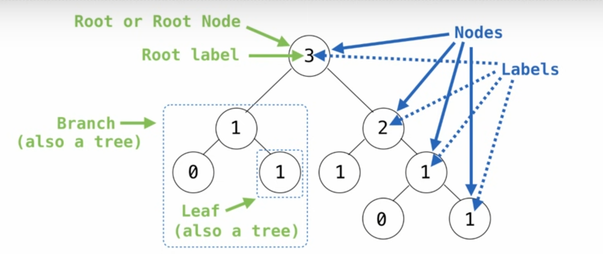

# Week 3

## Tue_Functional Decomposition & Debugging

### Assert

如果有一段代码

```python
def fact(x):
    if x == 0:
        return 1
    else:
        return x * fact(x - 1)

def half_fact(x):
    return fact(x / 2)
```

乍一看没有什么问题，但是当运行`half_fact(5)`的时候，会出现无限循环的报错，这是因为5 / 2 = 2.5，运行时，x-1无论怎么重复都不会出现 x == 0 成立的情况，所以这里传入的参数有个条件，要是正整数

```python
def fact(x):
    assert isinstance (x, int) # 这里是在判断x是否为整数
    assert x >= 0           # 这里是在判断x是否为正数
    if x == 0:
        return 1
    else:
        return x * fact(x - 1)

def half_fact(x):
    return fact(x / 2)
```

### Testing

可以在定义函数的时候写下文本测试内容

```python
def add_one(x):
    """
    add one

    >>>add_one(1)
    2
    >>>add_one(2)
    3
    >>>add_one(3)
    4
    """
    return x + 1
```

将代码保存为py文件`add_one.py`，然后运行如下代码

```bash
python3 -m doctest add_one.py
```

### Print Debugging

在合适的位置用`print`输出关键参数，可以更好的帮助你分析代码的运行情况

```python
def fact(x):
    print("x=", x)

    if x == 0:
        return 1
    else:
        return x * fact(x - 1)

def half_fact(x):
    return fact(x / 2)
```

### Interactive Debugging

```bash
python3 -i file.py
```

代码保存为`file.py`之后运行上述代码

或者还可以使用python tutor进行调试

### Error Types

大多数时候可以根据python报错的错误类型来判断代码的问题出在哪里（少数时候也有可能是其他问题间接导致的报错）

#### SyntaxError

* 您运行的文件不是有效的python语法
* 有错别字
* 多出或者缺少符号
* 写了一个声明语句的但是没有跟任何东西
  
#### Indentation Error

由于缩进不一致，导致python文件出现语法错误

* 用来编写python代码的文本编辑器不太对劲
* 打错字，多一个空格，少一个空格，都有可能导致缩进问题

#### TypeError:...'x' object is not callable

对象'X'不能被视为一个函数

* 不小心将非函数'x'作为一个函数调用
* 函数参数被分配给非函数
* 在函数外使用函数中的局部变量

#### TypeError:...NoneType...</br>

在错误的地方使用了None

#### NameError or UnboundLocalError

* Python looked up a name but didn't find it
* You name make a typo
* A typo in the name in the description
* (less common)Maybe you shadowed a Variable from the flobal frame in a local frame (see right)

### Tracebacks

代码运行出错时，根据回溯信息找到问题所在

* Read the error message(阅读错误信息)
  Remember what common error messages mean!
* Look at each line, bottom to top and see which one might be causing it(按顺序查看每一行，找出问题是什么导致的)

### Exceptions

Sometimes, computer programs behave in non-standard ways

* A function receives an argument value of an improper type
* Some resource (such as a file) is not available
* A network connection is lost in the midle of data transmission

A built-in mechanism in a programming language to declare and respond to exceptional conditions

Python raises an exception whenever an error occurs.

Exceptions can be handled by the program, preventing the interpreter from halting.

Unhandled exceptions will cause Python to halt execution and print a stack trace.

### Raising Exceptions

#### Assert Statements

Assert satements raise an exception of type AssertionError

```python
assert <expression>, <string>
```

Assertions are designed to be used libreally. They can be ignored to increase efficiency by running Python with the "-O" flag. "O" stands for optimized

```bash
python3 -O
```

Whether assertions are enabled is governed by a boll __debug__

#### Raise Statements

Exception are raised with a raise statement.

```python
raise <expression>
```

\<expression> must evaluate to a subclass of BassException or an instance of one.</br>

Exceptions are constructed like any other object. E.g., TypeError('Bad argument!')

* TypeError -- A function was passed the wrong number/type of argument
* NameError -- A name wasn't found
* KeyError -- A key wasn't found in a dictionary
* RuntimeError -- Catch-all for troubles during interpretation

### Try Statements

Try statements handle exceptions

```python
try:
    <try suite>
except <exception class> as <name>:
    <except suite>
```

__*Execution rule:*__

> The \<try suit> is executed first.
>
> If, during the course of executing the \<try suite>,</br>
> an exception is raised that is not handled otherwise, and
>
> If the class of the exception inherits from \<exception class>, them
>
> The \<except suite> is executed, with \<name> bound to the exception.

#### Handling Exceptions

Exception handling can prevent a program from terminating

```python
>>> try:
        x = 1 / 0
    except ZeroDivisionError as e: 
        print('handling a', type(e)) 
        x = 0

handling a <class 'ZeroDivisionError'>
>>> x
0
```

__Multiple try statements:__
Control jumps to the except suite of the most recent try statement that handles that type of exception

```python
def invert(x):
    y = 1/x
    print('Never printed if x is 0')
    return y

def invert_safe(x):
    try:
        return invert(x)
    except ZeroDivisionError as e:
        print('handled', e)
        return 0

>>> invert_safe(0)
handled division by zero
0
```

### Example: Reduce

__Reducing a Sequence to a Value__ </br>

```python
from operator import add, mul

def reduce(f, s, initial):
    """Combine elements of s pairwise using f, starting with initial.

    E.g., reduce(mul, [2, 4, 8], 1) is equivalent to mul(mul(mul(1, 2), 4), 8).

    >>> reduce(mul, [2, 4, 8], 1)
    64
    >>> reduce(add, [1, 2, 3, 4], 0)
    10
    """
    for x in s:
        initial = f(initial, x)
    return initial


def reduce(f, s, initial):
    """Combine elements of s pairwise using f, starting with initial.

    E.g., reduce(mul, [2, 4, 8], 1) is equivalent to mul(mul(mul(1, 2), 4), 8).

    >>> reduce(mul, [2, 4, 8], 1)
    64
    """
    if not s:
        return initial
    else:
        first, rest = s[0], s[1:]
        return reduce(f, rest, f(initial, first))
```

`f` is a two-argument function</br>
`s` is a sequence of values that can be the second argument</br>
`initial` is a value that can be the first argument

How to use reduce?

```python
def divide_all(n, ds):
    try:
        return reduce(truediv, ds, n)
    except ZeroDivisionError:
        return float('inf')
```

## Wed_Trees

### Box-and-Pointer Notation

__The Closure Property of Data Types__ </br>

A method for combining data values satisfies the closure property if: The result of combination can itself be combined using the same method</br>

Closure is powerful because it permits us to create hierarchical structures</br>

Hierarchical structures are made up of parts, which themselves are made up of parts, and so on</br>

__*Lists can contain lists as elements in addition to anything else*__</br>

Lists are represented as a row of index-labeled adjacent boxes, one per element

```python
>>> nested_list = [[1, 2], [], [[3, False, None], [4]]]

>>> nested_list[2][0][1]
False

>>> nested_list[2][0][0]
3
```

### Slicing

Slicing is an operation that you can perform on sequences, such as lists and ranges.

```python
>>> odds = [3, 5, 7, 9, 11]

>>> list(range(1, 3))
[1, 2]

>>> [odds[i] for i in range(1, 3)]
[5, 7]

>>> odds[1:3]
[5, 7]

>>> odds[:3]
[3, 5, 7]

>>> odds[1:]
[5, 7, 9, 11]

>>> odds[:]
[3, 5, 7, 9, 11] 
```

### Processing Container Values

Processing Container Values often involves iterating over all of the values contained in the list or dictionary that you're interested in.</br></br>

__*Sequence Aggregation*__</br>

Several built-in functions take iterable arguments and aggregate them into a value

* __sum__(iterable[, start]) -> value</br></br>
Return the sum of an iterable of numbers (NOT strings) plus the value of parameter 'start' (which defaults to 0). When the iterable is empty, return start.

```python
>>> sum([2, 4, 6], 1)
13

>>> sum([2,3,4])

>>> sum(1, 2, 3)
Traceback (most recent call last):
  File "<stdin>", line 1, in <module>
TypeError: sum() takes at most 2 arguments (3 given)

>>> sum(['2', '3', '4'])
Traceback (most recent call last):
  File "<stdin>", line 1, in <module>
TypeError: unsupported operand type(s) for +: 'int' and 'str'

>>> sum([[2, 3], [4]], [])
[2, 3 ,4]
```

* __max__(iterable[, key=func]) -> value</br>
__max__(a, b, c, ...[, key=func]) -> value</br></br>
With a single iterable argument, return its largest item.</br>
With two or more arguments, return the largest argument.

```python
>>> max(range(5))
4

>>> max(0, 1, 2, 3, 4)
4

>>> max(range(10), key=lambda x: 7-(x-4)*(x-2))
3

>>> (lambda x: 7-(x-4)*(x-2))(3)
8
```

* __all__(iterable) -> bool
</br></brr>
Return True if boll(x) is True for all values x in the iterable.
</br>
If the iterable is empty, return True.

```python
>>> all(range(5))
False

>>> all([x < 5 for x in range(5)])
True
```

### Trees

#### Tree Abstraction



* __Recursive description (wooden trees):__
</br>
A tree has a root label and a list of branches
</br>
Each branch is a tree
</br>
A tree with zero branches is called a leaf

* __Relative descriprion (family trees):__
</br>
Each location in a tree is called a node
</br>
Each node has a label that can be any value
</br>
One node can be the parent/child of another

People often refer to labels by their locations: "each parent is the sum of its children"

##### Implementing the Tree Abstraction

__REcursive description(wooden trees):__

* A __tree__ has a root __label__ and a list of __branches__
* Each branch is a tree
* A tree with zero branches is called a __leaf__

__Relative description(family trees):__

* Each lacation in a tree is called a __node__
* Each __node__ has __label__ that can be any value
* One node can be the __parent/child__ of another

People often refer to labels by their locations: "each parent is the sum of its children"

```python
def tree(label, branches=[]):
    for branch in branches:
        assert is_tree(branch), 'branches must be trees'    # Verifies the tree definition
    return [label] + list (branches)  # Creates a list from a sequence of branches

def label(tree):
    return tree[0]

def branches(tree):
    return tree[1:]

def is_tree(tree):
    if type(tree) != list or len(tree) < 1:  # Verifies that tree is bound to a list
        return False
    for branch in branches(tree):
        if not is_tree(branch):
            return False
    return True

def is_leaf(tree):
    return not branches(tree)
```

### Tree Processing

If i want to create a funtion that builds a Fibonacci tree:

```python
def fib_tree(n):
    if n <= 1:
        return tree(n)
    else:
        left, right = fib_tree(n-2), fib_tree(n-1)
        return tree(label(left)+label(right),[left, right])
```

#### Tree Processing Uses Recursion

__Count the leaves of a tree.__</br>
Processing a leaf is often the base case of a tree processing function

```python
def count_leaves(t):
    if is_leaf(t):
        return 1
    else:
        branch_counts = [count_leaves(b) for b in branches(t)]
        return sum(branch_counts)
```

Implement __leaves__, which returns a list of the leaf labels of a tree

```python
def leaves(tree):
    """Return a list containing the leaf labels of tree.

    >>> leaves(fib_tree(5))
    [1, 0, 1, 0, 1, 1, 0, 1]
    """
    if is_leaf(tree):
        return [label(tree)]
    else:
        return sum([leaves(b) for b in branches(tree)],[])
```

#### Creating Trees

A funtion that creates tree from another tree is typically also recursive

```python
def increment_leaves(t):
    """Return a tree like t but with leaf labels incremented"""
    if is_leaf(t):
        return tree(label(t) + 1)
    else:
        bs = [increment_leaves(b) for b in branches(t)]
        return tree(label(t), bs)
```

```py
def increment(t):
    """Return a tree like t but with all labels incremented."""
    return tree(label(t) + 1, [increment(b) for b in branches(t)])
```

### Example:Printing Trees

```py
def print_tree(t, indent=0):
    print('  ' * indent + str(label(t)))
    for b in branches(t):
        print_tree(b, indent+1)
```

## Thu_Mutable Sequences

### Object

An object is a value that behaves like what it's supposed to represent.

* Objects represent information
* They consist of data and behavior, bundled together to create abstractions
* Objects can represent things, but also properties, interactions, & processes
* A type of object is called a class; classes are first-class values in Python
* Object-oriented programming:
  * A metaphor for orgainzing large programs
  * Special syntax that can improve the composition of programs
* In Python, every value is an object
  * All objects have attributes
  * A lot of data manipulation happens through object methods
  * Functions do one thing; objects do many related things

### Mutation Operations

#### Some Objects Can Change

First example in the course of an object changing state

The same object can change in value throughout the course of computation

All names that refer to the same object are affected by a mutation

Only objects of mutable types can change:lists & dictionaries

```py
>>> suits = ['coin', 'string', 'myriad']
>>> original_suits = suits
>>> suits.pop()
'myriad'
>>> suits.remove('string')
>>> suits
['coin']
>>> suits.append('cup')
>>> suits.extend(['sword', 'club'])
>>> suits
['coin', 'cup', 'sword', 'club']
>>> suits[2] = 'spade'
>>> suits[0:2] = ['heart', 'diamond']
>>> suits
['heart', 'diamond', 'spade', 'club']
>>> original_suits
['heart', 'diamond', 'spade', 'club']
```

#### Mutation Can Happen Within a Function Call

A function can change the value of any object in its scope

### Tuples

#### Tuples are Immutable Sequences

Immutable values are projected from mutation

The value of an expression can change because of changes in namees or objects

An immutable sequence may still change if it contains a mutable value as an element

### Mutation

#### Sameness and Change

* As long as we never modify objects, a compound object is just the totality of its pieces
* A rational number is just its numerator and denominator
* This view is no longer valid in the presence of change
* A compound data object has an "identity" in addition to the pieces of which it is composed
* A list is still "the same" list even if we change its contents
* Conversely, we could have two lists that happen to have the same contents, but are different

#### Identity Operators

Identity

__\<exp0>__ is __\<exp1>__

evaluates to __True__ if both __\<exp0>__ and __\<exp1>__ evaluate to the same object

Equality

__\<exp0>__ == __\<exp1>__

evaluates to True if both __\<exp0>__ and __\<exp1>__ evaluate to equal values

> Identical objects are always equal values

#### Mutable Default Arguments are Dangerous

A default argument value is part of a function value, not generated by a call.
