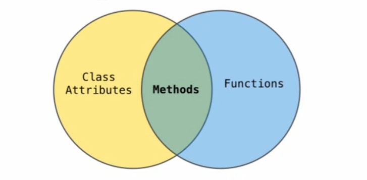
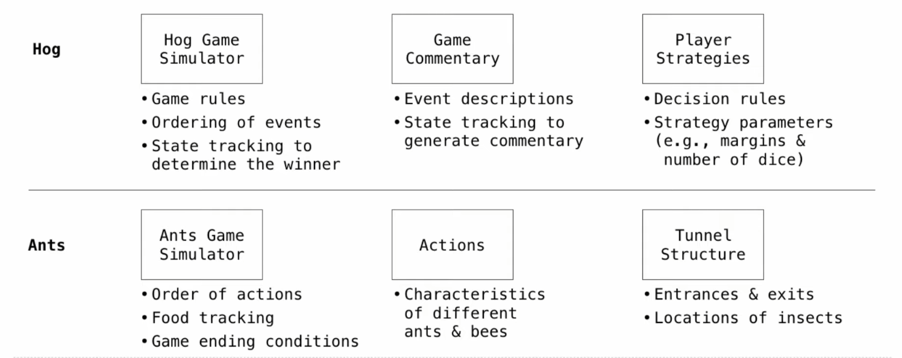

# Week_5

## Mon: Objects

### Object-Oriented Programming

A method for organizing modular programs

* Abstraction barriers
* Bundling together information and related behavior

A metaphor for computation using distributed state

* Each *object* has own local state.
* Each object also knows how to manage its own local state, based on method calls.
* Method calls are messages passed between objects.
* Several objects may all be instances of a common type.
* Different types may relate to each other.

Specialized syntax & vocabulary to support this metaphor

#### Classes

A class serves as a template for its instances

> **Idea:** All bank accounts have a balance and an account holder; the Account class should add those attributes to each newly created instance.

```py
>>> a = Account('Jim')
>>> a.holder
'Jim'
>>> a.balance
```

> **Idea:** All bank accounts should have "withdraw" and "deposit" behaviors that all work in the same way. -->

```py
>>> a.deposit(15)
15
>>> a.withdraw(10)
5
>>> a.balance
5
>>> a.withdraw(10)
'Insufficient funds'
```

> **Better idea:** All bank accounts share a "withdraw" method and a "deposit" method.

### Class Statements

#### The Class Statement

```py
class <name>:
    <suite> # The suite is executed when the class statement is executed
```

A class statement creates a new class and binds that class to `<name>` in the first frame of the current environment.

Assignment & def statements in `<suite>` create attributes of the class (not names in frames)

```py
>>> class Clown:
...     nose = 'big and red'
...     def dance():
...     return 'No thanks'
...
>>> Clown.nose
'big and red'
>>> Clown.dance()
'No thanks'
>>> Clown
<class '__main__.Clown'>
```

#### Object Construction

> **Idea:** All bank accounts have a balance and an account holder; the Account class should add those attributes to each of its instances

```py
>>> a = Account('Jim')
>>> a.holder
'Jim'
>>> a.balance
0
```

When a class is called:

  1. A new instance of that is created: balance: 0 &nbsp;&nbsp; holder: 'Jim'
  2. The `__init__` method of the class is called with the new object as its first argument (named `self`), along with any additional arguments provided in the call expression.

```py
class Account:
    # __init__ is called a contructor
    def __init__(self, account_holder):
        self.balance = 0
        self.holder = account_holder
```

#### Object Identity

Every object that is an instance of a user-defined class has a unique identity:

```py
>>> a = Account('Jim')
>>> b = Account('Jack') # Every call to Account creates a new Account instance. There is only one Account class.
>>> a.balance
0
>>> b.holder
'Jack'
```

Identity operators "is" and "is not" test if two expressions evaluate to the same object:

```py
>>> a is a
True
>>> a is not b
True
```

Binding an object to a new name using assignment does not create a new object:

```py
>>> c = a
>>> c is a
True
```

### Methods

Methods are defined in the suite of a class statement

```py
class Account:
  def __init__(self, account_holder):
    self.balance = 0
    self.holder = account_holder

  def deposit(self, amount):
    self.balance = self.balance + amount

  def withdraw(self, amount):
    if amount > self.balance:
      return  '自己有多少钱心里没点B数？'
    self.balance = self.balance - amount
    return self.balance
```

These def statements create function objects as always, but their names are bound as attributes of the class.

#### Invoking Methods

All invoked methods have access to the object via the self parameter, and so they can all access and manipulate the object's state.

```py
class Account
  def deposit (self, amount): # Defined with two arguments
    self.balance = self.balance + amount 
    return self.balance
```

Dot notation automatically supplies the first argument to a method.

```py
>>> tom_account = Account('TOm')
>>> tom_account.deposit(100) # Inboked with one argument
100
```

#### Dot Expressions

Objects receive messages via dot notation.

Dot notation accesses attributes of the **instance** or its **class**.

```<expression>, <name>```

The `<expression>` can be any valid Pytho expression.

The `<name>` must be a simple name

Evaluates to the value of the attribute looked up by `<name>` in the object
that is the value of the `<expression>`.

```py
>>> tom_account.deposit(10)
110
```

### Attributes

#### Accessing Attributes

Using getattr, we can look up an attribute using a string

```py
>>> getattr(tom_account, 'balance')
10
>>> hasattr(tom_account, 'deposit')
True
```

getattr and dot expressions look up a name in the same way

Looking up an attribute name in an object may return:

* One of the its instance attributes, **or**
* One of the attributes of its class

#### Methods and Functions

Python distinguishes between:

* Functions, which we have been creating since the beginning of the course,
* Bound methods, which couple together a function and the object on which that method will be invoked.

> Object + Function = Bound Methon

```py
>>> type(Account.deposit)
<class 'function'>
>>> type(tom_account.deposit)
<class 'method'>

>>> Account.deposit(tom_account, 1001)
1011
>>> tom_account.deposit(1000)
2011
```

#### Looking Up Attributes by Name

`<expression>, <name>`

To evaluate a dot expression:

1. Evaluate the `<expression>` to the left of the dot, which yields the object of the dot expression.
2. `<name>` is matched against the instance attributes of that object; **if an attribute with that name exists,** its value is returned.
3. If not, `<name>` is looked up in the class, which yields a class attribute value.
4. That value is returned **unless it is a function,** in which case a *bound method* is returned instead.

#### Class Attributes

Class attributes are "shared" across all instances of a class because they are attributes of the class, not the instance.

```py
class Account:
  interest = 0.02   # A class attribute

  def __init__(self, account_holder):
    self.balance = 0
    self.holder = account_holder

  # Addittional methods would be defined here
```

```py
>>> tom_account = Account('Tom')
>>> jim_account = Account('Jim')
>>> tom_account.interest # interest is not part of the instance that was somehow copied from the class!
0.02
>>> jim_account.interest
0.02
```

### Examples: Object

Instance attributes are found before class attributes; class attributes are inherited

```py
class Worker:
  greeting = 'Sir'

  def __init__(self):
    self.elf = Worker
  
  def work(self):
    return self.greeting + ', I work'

  def __repr__(self):
    return Bourgeoisie.greeting

class Bourgeoisie(Worker):
  greeting = 'Peon'
  
  def work(self):
    print(Worker.work(self))
    return 'I gather wealth'

jack = Worker()
john = Bourgeoisie()
jack.greeting = 'Maam'
```

```py
>>> Worker().work()
'Sir, I work'

>>> jack
Peon

>>> jack.work()
'Maam, I work'

>>> jack.work()
'Maam, I work'

>>> john.work()
Peon, I work
'I gather wealth'

john.elf.work(john)
'Peon, I work'
```

## Tue: Inheritance

### Attributes&nbsp;

#### Terminology: Attributes, Functions, and Methods

All objects have attributes, which are name-value pairs

Classes are objects too, so they have attributes

Instance attribute: attrubute of an instance

Class attribute: attribute of the class of an instance

> **Terminology**
> 
> **Python object system:**
>
> Functions are object.
>
> Bound methods are alse objects: a funtion that has its frist parameter "self" already bound to an instance.
>
> Dot expressions evaluate to bound methods for class attributes that are functions.
>
> `<instance>.<method_name>`

#### Reminder:Looking Up Attributes by Name

`<expression>.<name>`

To evaluate a dot expression:

1. Evaluate the `<expression>` to the left to the dot, which yields the object of the dot expression.
2. `<name>` is matched against the instance attributes of that object; if an attribute with that name exists, its value is returned.
3. If not, `<name>` is looked up in the class, which yields a class attribute value.
4. That value is returned unless it is a function, in which case a bound method is returned instead.

### Attribute Assignment

#### Assignment to Attributes

Assignment statements with a dot expression on their left-hand side affect attributes for the object of that dot expression

* If the object is an instance, then assignment sets an instance attribute
* If the object is class, then assignment sets a class attribute

```py
class Account:
  interest = 0.02
  def __init__(self, holder):
    self.holder = holder
    self.balance = 0

tom_account = Account('Tom')
```

Instance Attribute Assignment:

```py
tom_account.interest = 0.08   # Attribute assignment adds or modifies the attribute named "interest" of tom_account
```

Class Attribute Assignment:

```py
Account.interest = 0.04
```

```py
>>> jim_account = Account('Jim')
>>> tom_account = Account('Tom')
>>> tom_account.interest
0.02
>>> jim_account.interest
0.02

>>> Account.interest = 0.04
>>> tom_account.interest
0.04
>>> jim_account.interest
0.04

>>> jim_account.interest = 0.08
>>> jim_account.interest
0.08
>>> tom_account.interest
0.04

>>> Account.interest = 0.05
>>> jim_account.interest
0.08
>>> tom_account.interest
0.05
```

### Inheritance

Inheritance is a method for relating classes together.

A common use: Two similar classes differ in their degree of specialization

The specialized class may have the same attributes as the general class, along with some special-case behavior.

```py
class <name>(<base class>):
  <suite>
```

Conceptually, the new subclass "shares" attribute withe its base class.

The subclass may *override* certain inherited attributes.

Using inheritance, we implement a subclass by specifying its differences from the the base class.

#### Inheritance Example

A Checking Account is a specialized type of Acount.

```py
>>> ch = CheckingAccount('Tom')
>>> ch.interest     # Lower interest rate of checking accounts
0.01
>>> ch.deposit(20)  # Deposits are the same
20
>>> ch.withdraw(5)  # Withdrawals incur a $1 fee
14
```

Most behavior is shared with the base class Account

```py
class CheckingAccount(Account):
  """A bank account that charges for withdrawals."""
  withdraw_fee = 1
  interest = 0.01
  def withdraw(self, amount):
    return Account.withdraw(self, amount + self.withdraw_fee)
```

#### Looking Up Attribute Names on Classes

Base class attributes aren't copied into subclasses!

To look up a name in a class.

1. If it names an attributes in the class, return the attribute value.
2. Otherwise, look up the name in the base class, if there is one.

```py
>>> ch = CheckingAccount('Tom')   # Calls Account.__init__
>>> ch.interest       # Found in CheckingAccount
0.01
>>> ch.deposit(20)    # Found in Account
20
>>> ch.withdraw(5)    # Found in CheckingAccount
14
```

### Object-Oriented Design

#### Designing for Inheritance

Don't repeat yourself; use existing implementations

Attributes that have been overridden are still accessible via class objects.

Look up attributes on instances whenever possible

```py
class CheckingAccount(Account):
  """A bank account that charges for withdrawals."""
  withdraw_fee = 1
  interest = 0.01
  def withdraw(self, amount):
    return Account.withdraw(self, amount + self.withdraw_fee)
```

#### Inheritance and Composition

Object-oriented programming shines when we adopt the metaphor.

Inheritance is best for representing is-a relationships

* E.g., a checking account **is a** specific type of account. </br> So CheckingAccount inherits from Account.

Composition is best for representing has-a relationships.

* E.g., a bank **has a** collection of bank accounts it manages. </br> So, A bank has a list of accounts as an attribute

```py
class Bank:
  """A bank *has* accounts.

  >>> bank = Bank()
  >>> john = bank.open_account('John', 10)
  >>> jack = bank.open_account('jack', 5, CheckingAccount)
  0.02
  >>> jack.interest
  0.01
  >>> bank.pay_interest()
  >>> john.balance
  10.2
  >>> bank.too_big_to_fail()
  True
  """
  def __init__(self):
    self.accounts = []
  def open_account(self, holder, amount, k):
    account = kind(holder)
    account.deposit(amount)
    self.accounts.append(account)
    return account

  def pay_interest(self):
    for a in self.accountjs:
      a.deposit(a.balance * a.interest)

  def too_big_to_fail(self):
    return len(self.accounts) > 1
```

### Attributes Lookup Practice

```py
class A:
    z = -1
    def f(self, x):
        return B(x-1)

class B(A):
    n = 4
    def __init__(self, y):
        if y:
            self.z = self.f(y)
        else:
            self.z = C(y+1)

class C(B):
    def f(self, x):
        return x

a = A()
b = B(1)
b.n = 5
```

```py
>>> C(2).n
4

>>> a.z == C.z
True

>>> a.z == b.z
False

>>> b.z
<__main__.B at 0x1fe3b7fb220>

>>> b.z.z
<__main__.C at 0x1fe3b7f9c60>

>>> b.z.z.z
1

>>> b.z.z.z.z
AttributeError
```


### Multiple Inheritance

```py
class SavingsAccount(Account):
  deposit_fee = 2
  def deposit(self, amount):
    return Account.deposit(self, amount - self.deposit_fee)
```

A class may inherit from multiple base classes in Python

CleverBank marketing executive wants:

* Low interest rate of 1%
* A $1 fee for withdrawals
* A $2 fee for deposits
* A free dollar when you open your account

```py
class AsSeenOnTVAccount(CheckingAccount, SavingsAccount):
  def __init__(self, account_holder):
    self.holder = account_holder
    self.balance = 1      # A free dollar
```

A class may inherit from multiple base classes in Python.

```py
>>> such_a_deal = AsSeenOnTVAccount("John")
>>> such_a_deal.balance
1
>>> such_a_deal.deposit(20)
19
```

#### Resolving Ambiguous Class Attribute Names


## Wed:Linked Lists & Trees

### Linked Lists

#### Linked List Structure

A linked list is either empty or a first value and the rest of the linked list


#### Linked List Class

Linked list class: attributes are passed to `__init__`

```py
class Link:
  empty = ()      # Some zero-length sequence
  def __init__(self, first, rest=empty):
    assert rest is Link.empty or isinstance(rest, Link)     # Return whether rest is a Link
    self.first = first
    self.rest = rest
```

`help(instance)`: Return whether an object is an instance of a class or of a subclass thereof.

### Property Methods

In some cases, we want the value of instance attributes to be computed on demand

For exqmple, if we want to access the second element of a linked list

The @property decorator on a method designates that it will be called whenever it is looked up on an instance

A `@<attribute>.setter` decorator on a method designates that it wll be called whenever that attribute is assigned. `<attribute>` must be an existing property method

### Tree Class

A Tree has a label and a list of branches; each branch is a Tree

```py
class Tree:
    
    def __init__(self, label, branches=[]):
        self.label = label
        for branch in branches:
            assert isintance(branch, Tree)
        self.branches = list(branches)
```

```py
def fib_tree(n):
    if n == 0 or n == 1:
        return Tree(n)
    else:
        left = fib_tree(n-2)
        right = fib_tree(n-1)
        fib_n = left.label + right.label
        return Tree(fib_n, [left, right])

def leaves(t):
  """Return a list of leaf labels in Tree T."""
  if t.is_leaf():
    return [t.label]
  else:
    all_leaves = []
    for b in t.branches:
      all_lieaves.extend(leaves(b))
    return all_leaves

def height(t):
  """Return thej number of transitions in the longest path in T."""
  if t.is_leaf():
    return 0
  else:
    return 1 + max((height(b) for b in t.branches))
```

### Measuring Efficiency

#### Memoization

**Idea:** Remember the results that have been computed before

```py
def memo(f):
  cache = {}      # Keys are arguments that map to return values
  def memoized(n):
    if n not in cache:
      cache[n] = f(n)
    return cache[n]
  return memoized     # Same behavior as f, if f is a pure function
```

#### Exponentiation

**Goal:** one more multiplication lets us double the problem size

```py
def exp(b, n):
  if n == 0:
    return 1
  else:
    return b * exp(b, n-1)

def exp_fast(b, n):
  if n == 0:
    return 1
  elif n % 2 == 0:
    return square(exp_fast(b, n//2))
  else:
    return b *  exp_fast(b, n-1)

def square(x):
  return x * x
```

### Linked List Mutation Example

```py
def add(s, v):
  """
  Add v to an ordered list s with no repeats, returning modified s.
  
  If v is already in s, then don't modify s, but still return it.
  """
  assert s is not List.empty
  if s.first > v:
    s.first, s.rest = v, Link(s.first, s.rest)
  elif s.first < v and empty(s.rest):
    s.rest = Link(v)
  elif s.fist < v:
    add(s.rest, v)
  return s
```

## The:Interfaces

### String Representations

An object value should behave like the kind of data it is meant to represent

For instance, by producing a string representation of itself

String are important: they represent language and programs

In Python, all object produce two string representations:

* The `str` is legible to humans
* The `repr` is legible to the Python interpretre

The `str` and `repr` strings are often the samme, but not always

#### The repr String for an Object

The `repr` function returns a Python expression (a string) that evaluates to an equal object

> repr(object) -> string    </br></br>
> Return the canonical string representation of the object.   </br>
> For most object types, eval(repr(object)) == object.

The result of calling `repr` on a value is what Python prints in an interactive session

```py
>>> 12e12
12000000000000.0
>>> print(repr(12e12))
12000000000000.0
```

Some objects do not have a simple Python-readable string

```py
>>> repr(min)
'<built-in function min>'
```

#### The str String for an Object

Human interpretable sstrings are useful as well:

```py
>>> from fractions import Fraction
>>> half = Fraction(1, 2)
>>> repr(half)
'Fraction(1, 2)'
>>> str(half)
1/2
```

The result of calling `str` on the value of an expression is what Python prints using the `print` function:

```py
>>> print(half)
1/2
```

### Polymorphic Functions

Polymorphic function: A function that applies to many (poly) different forms (morph) of data

`str` and `repr` are both polymorphic; they apply to any object

repr invokes a zero-argument method __repr__ on its argument

```py
>>> half.__repr__()
'Fraction(1, 2)'
```

`str` invokes a zero-argument method __str__ on its argument

```py
>>> half.__str__()
'1/2'
```

#### Implementing repr and str

The behavior of `repr` is slightly more complicated than invoking `__repr__` on its argument:

* An instance attribute called __repr__ is ignored! Only class attributes are found

```py
def repr(x):
  return type(x).__repr__(x)
```

The behavior of `str` is also complicated

* An instance attribute called `__str__` is ignored
* If no `__str__` attribute is found, uses repr string
* `str` is a class, not a function

#### Interfaces

**Message passing:** Objects interact by looking up attributes on each other (passing messages)

The attribute look-up rules allow different data types to respond to the same message

A **shared message** (attribute name) that elicits similar behavior form different object classes is a powerful method of abstraction

An interface is a set of shared messages, along with a specification of what they mean

> Example:
>
> Classes that implement __repr__ and __str__ methods that return Python-interpretable and human-readable strings implement an interface ofr producing string representations

### Special Method Names

#### Special Method Names in Python

Certain names are special because they have built-in behavior

These names always start and end with two underscores

> `__init__` &nbsp;: Method invoked automatically when an object is constructed
>
> `__repr__` &nbsp;: Method invoked to display an object as a Python expression
>
> `__add__` &nbsp;&nbsp;&nbsp;: Method invoked to add one object to another
>
> `__bool__` &nbsp;: Method invoked to convert an object to True or False
>
> `__float__`: Method invoked to convert an object to a float (real number)

#### Special Methods

Adding instances of user-defined classes invokes either the ``__add__` or `__radd__`` method

### Modular Design

#### Separation of Concerns

A design principle: Isolate different parts of a program that address different concerns



### Sets

One more built-in Python container type

* Set literals are enclosed in braces
* Duplicate elements are removed on construction
* Sets have arbitrary order

```py
>>> s = {'one', 'two', 'three', 'four', 'four'}
>>> s 
{'three', 'one', 'four', 'two'}
>>> 'three' in s
True
>>> s.union({'one', 'five'})
{'three', 'five', 'one', 'four', 'two'}
>>> s.intersection({'six', 'five', 'four', 'three'})
{'three', 'four'}
```
