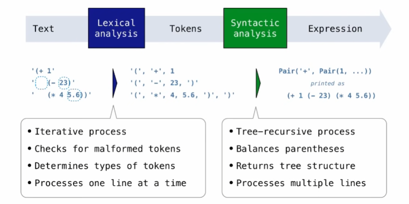
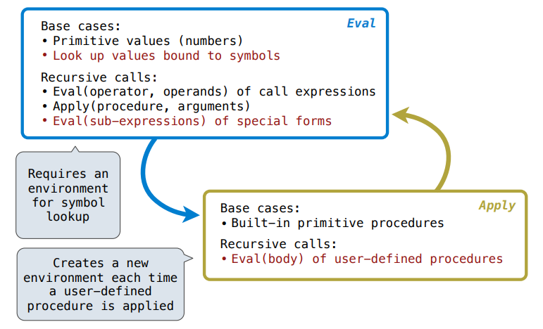
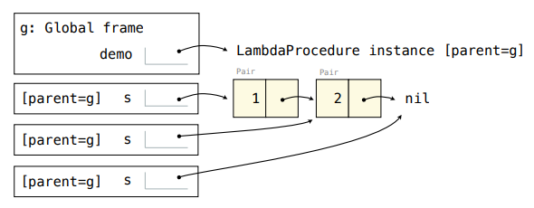
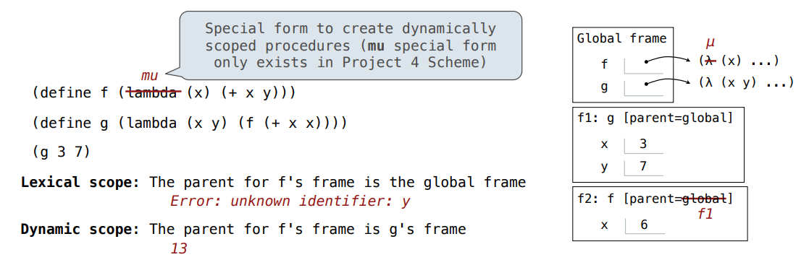

# Week 6

## Mon: Scheme

### Scheme

#### Scheme is a Dialect of Lisp

What are people saying about Lisp?

* "The greatest single programming language ever designed."
  
  -Alan kay, co-inventor of Smalltalk and OOP
* "The only computer language that is beautiful."
  
  -Neal Stephenson, DeNero's favorite sci-fi author
* "God's programming language."
  
  -Brian Harvey, Berkeley CS instructor extraordinaire

#### Scheme Fundamentals

Scheme programs consist of expressions, which can be:

* Primitive expressions: 2, 3.3, true, +, quotient, ...
* Combinations: (quotient 10 2), (not true), ...

Numbers are self-evaluating; symbols are bound to valus.

Call expressions include an operator and 0 or more operands in parentheses

```scheme
> (quotient 10 2)
5

> (quotient (+ 8 7) 5)
3
```

### Special forms

A combination that is not a call expression is a special form:

* **If** expression:    `(if <predicate> <consequent> <alternative>)`
  Evaluation:
  1. Evaluate the predicate expression.
  2. Evaluate either the consequent or alternative.

* **And** and **or**:   `(and <e1> ... <en>)`, `(or <e1> ... <en>)`
* Binding symbols:      `(define <symbol> <expression>)`
* New procedures:       `(define (<symbol> <formal parameters>) <body>)`

```scheme
> (define pi 3.14) 
> (* pi 2)
6.28

> (define (abs x)
    (if (< x 0)
        (- x)
        x))

> (abs -3)
3

> (define (square x) (* x x))
> (square 3)
3

> (define (average x y)
    (/ (+ x y) 2))
> (average 1 9)
5

> (define (sqrt x)
    (define (update guess)
        (if (= (square guess) x)
            guess
            (update (average x (/ x guess)))))
  (update 1))
> (sqrt 4)
2
```

### Lambda expressions

Lambda expressions evaluate to anonymous procedures.

`(lambda (<formal-parameters>) <body>)`

Two equivalent expressions:

`(define (plus4 x) (+ x 4))`

`(define plus4 (lambda (x) (x + 4)))`

An operator can be a call expression too:

`((lambda (x y z) (+ x y (square z))) 1 2 3)` Ebaluates to the add-x-&-y-&-z^2 procedure

### Lists

In the late 1950s, computer scientists used confusing names

* **cons:** Two-argument procedure that creates a linked list
* **car:** Procedure that returns the first element of a list
* **cdr:** Procedure that returns the rest of a list
* **nil:** The empty list

**Important! Scheme lists are written in parentheses with elements separated by spaces.**

```scm
> (cons 1 (cons 2 nil))
(1 2)

> (define x (cons 1 (cons 2 nil)))
> x
(1 2)

> (car x)
1
> (cdr x)·
(2)

> (define s (cons 1 (cons 2 nil)))
> (cons (cons 4 (cons 3 nil)) s)
((4 3) 1 2)
```

### Symbolic Programming

Symbols normally refer to values; how do we refer to symbols?

```scheme
> (define a 1)
> (define b 2)
> (list a b)
(1 2)  ; No sign of "a" and "b" in the resulting value
```

Quotation is used to refer to symbols directly in Lisp.

```scheme
> (list 'a 'b)    ; Shor for (quote a), (quote b): Special form to indicate that the expression itself is the value.
(a b)

> (list 'a b)
(a 2)
```

Quotation can also be applied to combinations to form lists.

```scheme
> '(a b c)
(a b c)

> (car '(a b c))
a

> (cdr '(a b c))
(b c)
```

`'a` is the same as `(quote a)`

The nice thing about the single quote is that it sabes you a set of nested parentheses.

### Programming Languages

A computer typically executes programs written in many different programming languages

**Machine languages:** statements are interpreted by the hardware itself

* A fixed set of instructions invoke operations implemented by the circuitry of the central processing unit (CP)
* Operations refer to specific hardware memory addresses; no abstraction mechanisms

**High-level languages:** statements & expressions are interpreted by another program or compiled (translated) into another language

* Provide means of abstraction such as naming, function definition and objects
* Abstract away system details to be independent of hardware and operating system

#### Metalinguistic Abstraction

A powerful for of abstraction is to define a new language that is tailored to a particular type of application or problem domain

**Type of application:** Erlang was designed for concurrent programs. It has built-in elements for expressing concurrent communication. It is used, for example, to implement chat servers with many simultaneous connections

**Problem domain:** The MediaWiki mark-up language was designed for generating static web pages. It has built-in elements for text formatting and cross-page linking. It is used, for example, to create Wikipedia pages

A programming language has:

* **Syntax:** The legal statements and expressions in the language
* **Semantics:** The execution/evaluation rule for those statements and expressions

To create a new programming language, you either need a:

* **Specification** A document describe the precise syntax and semantics of the language
* **Canonical Implementation:** An interpreter or compiler for the language

## Tue:Interpreters

### Parsing

A Parser takes text and returns an expression.



#### Recursive Syntactic Analysis

A predictive recursive descent parser inspects only *k* tokens to decide how to proceed, for some fixed *k*.

Syntatic analysis identifies the hierarchical structure of an expression, which may be nested.

Each call to scheme_read consumes the input tokens for exactly one expression.

> '(', '+", 1, '(', '-', 23, ')', '(', '*', 4, 5.6, ')', ')'

**Base case:** symbols and numbers

**Recursive call:** scheme_read sub-expressions and combine them

### Calculator

#### The Pair Class

The Pair class represents Scheme pairs and lists. A list is a pair whose second element is either a list or nil.

Sheme expressions are represented as Scheme lists! *Homoiconic* means source code is data.

#### Calculator Syntax

The Calculator language has primitive expressions and call expressions. (That's it!)

A primitive expression is a numbeer: 2, -4, 5.6

A call expression is a xombination that begins with an operator (+, -, *, /) followed by 0 or more expressions: (+ 1 2 3), (/ 3 (+ 4 5))

Expressions are represented as Scheme lists (Pair instances) that encode tree structures.


#### Calculator Semantics

The value of a calculator expression is defined recursively.

**Primitive:** A number evaluates to itself.

**Call:** A call expression evaluates to its argument values conbined by an operator.
> +：Sum of the arguments
>
> *: Product of the arguments
>
> -: If one argument, negate it. If more than one, subtract the rest form the first.
>
> /: If one argument, invert it. If more than one, divide the rest from the first.

### Evaluation

#### The Eval Function

The eval function computies the value of an expression, which is always a number.

It is a generic function that dispatches on the type of the expression (primitive or call)

#### Appling Built-in Operators

The apply function applies some operation to a (Scheme) list of argument values.

In calculator, all operations are named by built-in operators: +, -, *, /

### Interactive Interpreters

#### Read-Eval-Print Loop

The user interface for many programming languages is an interactive interpreter.

* Print a prompt
* **Read** text imput from the user.
* Parse the text input into an expression.
* **Evaluate** the expression.
* If any errors occur, report those errors, otherwise
* **Print** the value of the expression and repeat.

#### Raising Exceptions

Exceptions are raised within lexical analysis, syntactic analysis, eval, and apply.

Example exceptions

* **Lexical analysis:** The token 2.3.4 raises **ValueError**("invalid numeral")
* **Syntactic analysis:** An extra ) raises **SyntaxError**("unexpected token")
* **Eval:** An empty combination raises **TypeError**("() is not a number or call expression")
* **Apply:** No arguments to - raises **TypeError**("- requires at least 1 argument")

#### Handling Exceptions

An interactive interpreter prints information about each error.

A well-designed interactive interpreter should not half completely on an error, so that the user has an opportunity to try again in the current environment.

### Interpreting Scheme

#### The Structure of an Interpreter



### Special Forms

#### Scheme Evaluation

The scheme_eval function dispatches on expression form:

* Symbols are bound to values in the current environment.
* Self-evaluating expressions are returned.
* All other legal expressions are represented as Scheme lists, called *combinations*

> `(if <predicate> <consequent> <alternative>)`
>
> `(lambda (<formal-parameters>) <body>)`
>
> `(define <name> <expression>)`
>
> `(<opeerator> <operand 0> ... <operand k>)`
>
> Special forms are identified by the first list element
>
> Any combination that is not a known special form is a call expresion

### Logical Forms

Logical forms may only evaluate some sub-expressions.

* **If** expression: `(if <predicate> <consequent> <alternative>)`
* **And** an **or:** `(and <e1> ... <en>)`, `(or <e1> ... <en>)`
* **Cond** expression: `(cond (<p1> <e1>) ... (<p1> <e1>) (else <e>))`

The value of an **if** expression is the value of a sub-expression.

* Evaluate the predicate.
* Choose a sub-expression: `<consequent>` or `<alternative>`.
* Evaluate that sub-expression in place of the whole expression.

### Quotation

The **quote** special form evaluates to the quoted expression, which is **not** evaluated.

`(quote <expression>)`

> `(quote (+ 1 2))`
>
> evaluates to the three-element Scheme list
>
> (+ 1 2)

The `<expression>` itself is the value of the expression.

`'<expression>` is shorthand for `(quote <expression>)`.

> `(quote (1 2))` is equivalent to `'(1 2)`

The scheme_read parser converts shorthand to a combination.

### Lambda Expressions

Lambda expressions evaluate to user-defined procedures.

`(lambda (<formal-parameters>) <body>)`

> `(lambda (x) (* x x))`

```py
class LambdaProcedure:
    def __init__(self, formals, body, env):
        self.formals = formals
        self.body = body
        self.env = env
```

#### Frames and Environments

A frame represents an environment by having a parent frame.

Frames are Python instances with methods **lookup** and **define**.

In Project 4, Frames do not hold return values.

### Define Expressions

Define binds a symbol to a value in the first frame of the current environment

`(define <name> <expression>)`

1. Evaluate the `<expression>`.
2. Bind `<name>` to its value in the current frame.

`(define x (+ 1 2))`

Procedure definition is shorthand of define with a lambda expression.

`(define (<name> <formal parameters>) <body>)`

`(definde <name> (lambda (<formal parameters>) <body>))`

#### Applying User-Defined Procedures

To apply a user-defined procedure, create a new frame in which formal parameters are bound to argument values, whose parent is the **env** of the procedure.

Evaluate the body of the procedure in the environment that starts with this new frame.

> `(define (demo s) (if (null? s) '(3) (cons (car s) (demo (cdr s)))))`
>
> `(demo (list 1 2))`
>
> 

## Wed:More Scheme

### Dynamic Scope

The way in which names are looked up in Scheme and Python is called *lexical scope* (or *static scope*).

**Lexical scope:** The parent of a frame is the environment in which a procedure was *defined*.

**Dynamic scope:** The parent of a frame is the environment in which a procedure was *called*.



### Tail Recursion

#### Functional Programming

All functions are pure functions.

No re-assignment and no mutable data types.

Name-value bindings are permanent.

Advantages of functional programming:

* The value of an expression is independent of the order in which sub-expressions are evaluated.
* Sub-expressions can safely be evaluated in parallel or on demand (lazily).
* **Referential transparency:** The value of an expression does not change when we substitute one of its subexpression with the value of that subexpression.

But... no for/while statements! We can make basic iteration efficient!

#### Recursion and Iteration in Python

In Python, recursive calls always create new active frames.

`factorial(n, k)` computes: k * n!

```py
def factorial(n, k):
    if n == 0:
        return k
    else:
        return factorial(n-1, k*n)
```

### Tail Calls

A procedure call that has not yet returned is active. Some procedure calls are *tail calls.* A Scheme interpreter should support an *unbounded number* of activa tail calls using only a constant amount of space.

A tail call is a call expression in a tail context:

* The last body sub-expression in a lambda expression
* Sub-expressions 2 & 3 in a tail context **if** expression
* All non-predicate sub-expressions in a tail context **cond**
* The last sub-expression in a tail context **and** or **or**
* The last sub-expression in a tail context **begin**

#### Example: Length of a List

```scheme
(define (length s)
    (if (null? s) 0
        (+ 1 (length (cdr s)))))
```

A call expression is not a tail call if more computation is still required in the calling procedure.

Linear recursive procedures can often be re-written to use tail calls.

```scheme
(define (length-tail s)
    (define (length-iter s n)
        (if (null? s) n
            (length-iter (cdr s) (+ 1 n))))
    (length-iter s 0))
```

#### Eval with Tail Call Optimization

The return value of the tail call is the return value of the current procedure call.

Therefore, tail calls shouldn't increase the environment size.

### Map and Reduce

#### Example: Reduce

```scheme
(define (reduce procedure s start)
    (if (null? s) start
        (reduce procedure
            (cdr s)
                (procedure start (car s)) ) ) )
```

Recusive call is a tail call.

Other calls are not; constant space depends on whether procedure requires constant space.

#### Example: Map with Only a Constant Number of Frames

```scheme
(define (map procedure s)
    (if (null? s)
        nil
            (cons (procedure (car s))
                (map procedure (cdr s)))))
```

### General Computing Machines
